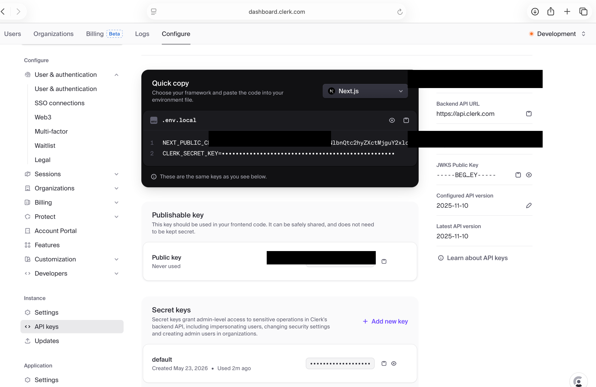
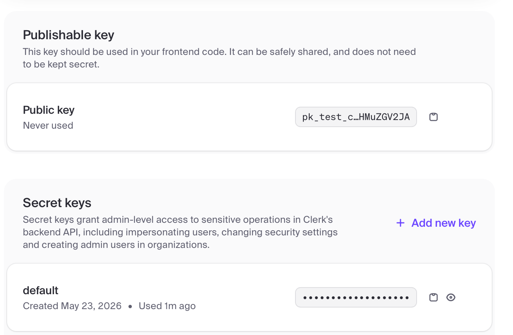
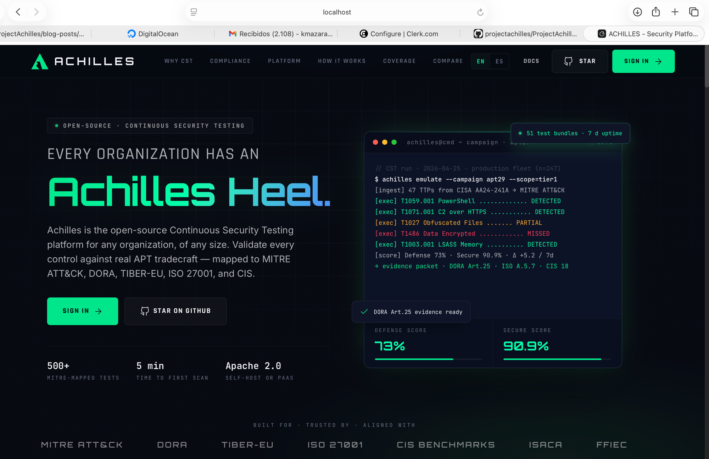
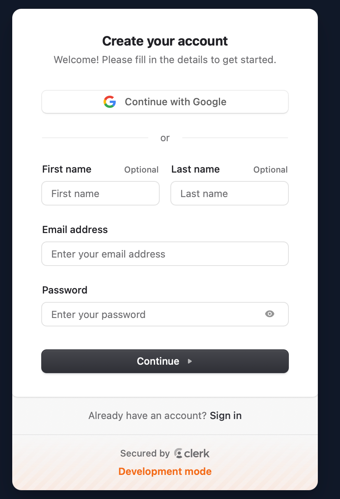
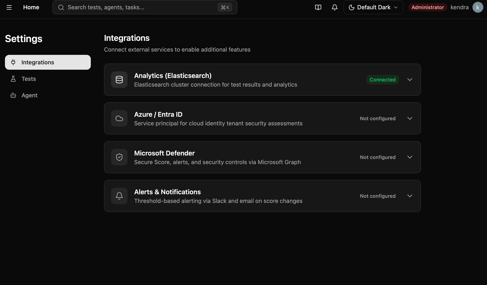
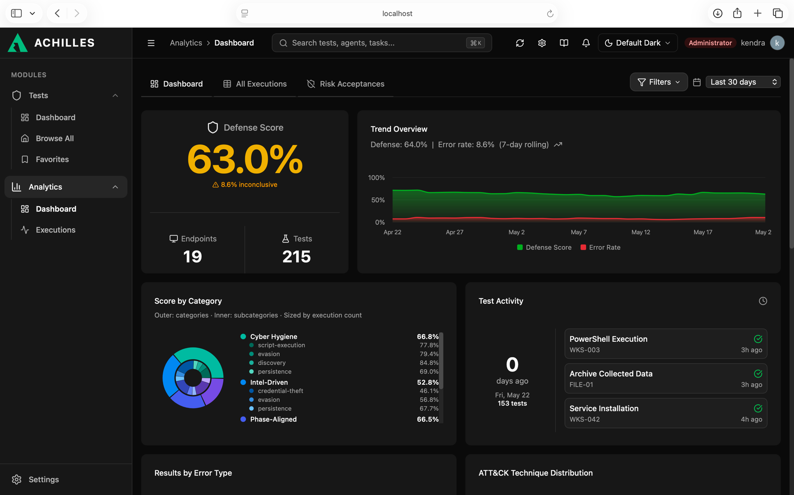

# Instala Project Achilles en 30 Minutos: Guía Paso a Paso

> **Serie: Empezando con Project Achilles — Parte 1 de 6**

**Tiempo de lectura:** 12 minutos | **Dificultad:** Principiante 🟢

---

## TL;DR

- Achilles tiene dos partes: la plataforma (dashboard + servidor) y el agente (en cada máquina a validar)
- Este post cubre solo la plataforma, el agente lo instalamos en QS-03
- Dos opciones: Docker en tu máquina local (Opción A, gratis) o VPS en la nube como DigitalOcean (Opción B, ~$8/mes)
- Al terminar tendrás el dashboard corriendo con datos de ejemplo
- Tiempo estimado: 30 min (local) o 40 min (DigitalOcean)

---

## Lo Que Vas a Instalar

Achilles tiene dos partes:

```
PARTE 1: La plataforma Achilles
→ El dashboard web que usas para ver resultados
→ La base de datos donde se guardan los tests
→ El servidor al que se conectan los agentes

PARTE 2: El agente (en cada máquina que quieras monitorear)
→ Un programa pequeño (~8 MB)
→ Ejecuta las simulaciones de ataque
→ Reporta los resultados al dashboard
```

Primero instalas la plataforma. Luego instalas el agente en tus máquinas.

---

## Elige Tu Opción para la Plataforma

### Opción A: Self-hosted con Docker — Gratis 🐳

**Para quién:** Quieres que todo quede en tu infraestructura, o no quieres pagar.

```
Pros:
✅ Completamente gratis
✅ Todos los datos se quedan en tu red
✅ Control total

Contras:
→ Necesitas una máquina dedicada (puede ser la misma donde
   instalas el agente si es un equipo de prueba)
→ Tú gestionas las actualizaciones
```

**Requisitos mínimos del servidor:**
```
Sistema operativo: Linux, macOS o Windows con Docker Desktop
RAM: 2 GB mínimo (4 GB recomendado)
Disco: 10 GB libres
Docker: versión 24 o superior
```

**¿Tienes Docker instalado?**
```bash
docker --version
# Docker version 24.x.x — ✓ listo

docker compose version
# Docker Compose version v2.x.x — ✓ listo
```

Si no tienes Docker:
- Windows/Mac: descarga **Docker Desktop** desde https://docker.com/products/docker-desktop
- Linux: usa el script oficial de Docker (instala la versión más reciente):
  ```bash
  curl -fsSL https://get.docker.com | sh
  ```

---

### Opción B: Servidor en la nube (ej. DigitalOcean) — ~$8/mes ☁️

**Para quién:** Quieres que el dashboard sea accesible desde cualquier lugar y que los agentes puedan conectarse desde fuera de tu red local.

```
Pros:
✅ Accesible desde cualquier lugar — URL pública para ti y los agentes
✅ No consume recursos de tu máquina local
✅ Los datos se quedan en TU servidor, no en un tercero

Contras:
→ Cuesta ~$8/mes (droplet básico en DigitalOcean o equivalente)
→ Tú gestionas el servidor (actualizaciones, backups)
→ Requiere los mismos pasos de instalación que la opción local
```

**Cómo empezar:** Sigue la **Sección 1B** de este post.

> **Nota:** Achilles es open-source, no existe una versión "cloud gestionada".
> Tú instalas, tú controlas. La nube es simplemente dónde eliges correrlo.

---

## Sección 1A: Instalar en Local (Docker en tu propia máquina)

*(Si elegiste la Opción B, DigitalOcean, salta a la Sección 1B)*

### Paso 1: Descargar Achilles

```bash
git clone https://github.com/projectachilles/ProjectAchilles
cd ProjectAchilles
```

Si no tienes git: descarga el ZIP desde GitHub → "Code" → "Download ZIP", extrae y entra a la carpeta.

### Paso 2: Crear tu cuenta de Clerk (autenticación gratuita)

Achilles usa Clerk para el login de usuarios. Necesitas crear una app gratuita:

```
1. Ve a https://clerk.com → "Start building for free"
2. Crea una cuenta (es gratis)
3. Crea una nueva aplicación:
   Nombre: "Achilles"
   Sign in options: deja Email activado (los demás son opcionales)
   → Google activado también funciona, añade el botón
     "Continuar con Google" al login
   → Password no aparece aquí, se activa después en el
     dashboard si lo necesitas (email code funciona igual)
4. Click "Create application"
5. En el dashboard de Clerk → Configure → API Keys
6. Copia estos dos valores:
   → Publishable key: pk_test_xxxxxxxxxx...
   → Secret key:      sk_test_xxxxxxxxxx...
```




### Paso 3: Configurar las variables de entorno

El repo incluye dos archivos de ejemplo (`.env.example`) que sirven como plantilla. El comando `cp` los copia con el nombre `.env`, que es el archivo real que Achilles lee al arrancar. Necesitas crear uno para cada parte:

```bash
# Para el servidor (backend) — aquí van las Clerk keys, CORS, etc.
cp backend/.env.example backend/.env

# Para el frontend — Docker Compose lo lee al construir el contenedor
cp .env.example .env
```

> Los archivos `.env.example` nunca se modifican — son la plantilla guardada en el repo.
> Los `.env` son tu copia local con tus valores reales, y están en `.gitignore` para que no se suban a GitHub.

Abre `backend/.env` con `nano backend/.env` y cambia solo estos tres valores:

```bash
# ── Clerk (obligatorio) ───────────────────────────
CLERK_SECRET_KEY=sk_test_xxxxxxxxxxxxxxxxxxxx
CLERK_PUBLISHABLE_KEY=pk_test_xxxxxxxxxxxxxxxxxxxx
```

> **`CORS_ORIGIN`** — no necesitas cambiarlo si usas Docker. Nginx sirve el frontend en el puerto 80 y hace de proxy hacia el backend internamente, el navegador nunca llama directamente al puerto 3000 y CORS no se dispara. Solo importa si corres Achilles fuera de Docker (modo desarrollo).
> **`ENCRYPTION_SECRET` y `AGENT_SERVER_URL`** — déjalos como están. `AGENT_SERVER_URL` lo ajustamos en QS-02 cuando instalemos el agente.

Crea el archivo `.env` en la raíz del proyecto (Docker Compose lo lee para pasar variables al contenedor del frontend):

```bash
# En la raíz del proyecto (junto a docker-compose.yml)
cp .env.example .env
```

Abre `.env` con `nano .env` y añade tu Clerk publishable key al principio del archivo — el `.env.example` raíz no trae este campo, hay que añadirlo manualmente:

```bash
# ============ Clerk (Frontend) ============
CLERK_PUBLISHABLE_KEY=pk_test_xxxxxxxxxxxxxxxxxxxx
```

> **¿Por qué dos archivos?**
> `backend/.env` lo lee el servidor directamente. El `.env` raíz lo lee Docker Compose al arrancar y se lo pasa al contenedor del frontend. Son dos rutas de configuración distintas.

### Paso 4: Arrancar todo

```bash
docker compose --profile elasticsearch up -d
```

> **¿Por qué `--profile elasticsearch`?** Achilles guarda los resultados de los tests en Elasticsearch — el módulo de Analytics lo usa para calcular el Defense Score, el heatmap de MITRE ATT&CK y las tendencias. Sin ese flag solo arrancan el backend y el frontend, pero Analytics no tiene datos. El perfil también carga 1,000 resultados de ejemplo automáticamente.

Espera 1-2 minutos mientras los contenedores arrancan. Verifica que todo está corriendo:

```bash
docker compose ps

# Deberías ver:
# achilles-backend    Up   0.0.0.0:3000->3000/tcp
# achilles-frontend   Up   0.0.0.0:80->80/tcp
# elasticsearch       Up   0.0.0.0:9200->9200/tcp
```


### Paso 5: Abrir el dashboard

Abre tu navegador en: **http://localhost**

Verás la landing page de Achilles. Click en **SIGN IN** (arriba a la derecha o en el centro de la página).



Verás el modal de login de Clerk. Como es la primera vez, click en **Sign up** (abajo del todo). Tienes dos opciones:

- **Con Google**: click en "Continue with Google" — Clerk maneja el OAuth automáticamente, sin email ni contraseña. Este botón solo aparece si dejaste Google habilitado en el Paso 2.
- **Con email**: rellena tu email y una contraseña, click **Continue** — Clerk te enviará un código de verificación para confirmar la cuenta.



### Paso 6: Verificar Elasticsearch

Ve a **Settings → Integrations**. Deberías ver Analytics (Elasticsearch) en estado **Connected** — Docker conecta Elasticsearch automáticamente al arrancar, no necesitas configurar nada.



Si por alguna razón aparece "Not configured", expande la tarjeta y pon:
```
Elasticsearch URL: http://elasticsearch:9200
```
Guarda y debería conectar de inmediato.

Ahora ve a **Analytics → Dashboard**. Verás el dashboard con los datos de ejemplo ya cargados: Defense Score, Trend Overview, Score by Category y Test Activity.



---

## Sección 1B: Instalar en DigitalOcean (VPS en la nube)

*(Si elegiste la Opción A, Docker local, ya terminaste con la Sección 1A, salta a la Sección 2)*

### Paso 1: Crear el droplet en DigitalOcean

```
1. Ve a https://digitalocean.com → "Sign Up" (o inicia sesión)
2. Click "Create" → "Droplets"
3. Elige la configuración:
   Imagen:    Ubuntu 22.04 LTS x64
   Plan:      Basic → Regular → $8/mes (1 vCPU, 2 GB RAM, 50 GB disco)
   Región:    La más cercana a tus máquinas (ej. NYC, AMS, FRA)
   Autenticación: SSH key (recomendado) o Password
4. Nombre del droplet: "achilles-server"
5. Click "Create Droplet"
6. Espera ~1 minuto — DigitalOcean te mostrará la IP pública
   Ejemplo: 167.99.123.45
```

### Paso 2: Conectarte al servidor

```bash
# Desde tu terminal local (Mac/Linux)
ssh root@167.99.123.45

# Windows: usa PuTTY o Windows Terminal con:
# ssh root@167.99.123.45
```

### Paso 3: Instalar Docker y Git

```bash
# Actualizar el sistema
apt update && apt upgrade -y

# Instalar Docker
curl -fsSL https://get.docker.com | sh

# Verificar que Docker está corriendo
docker --version
docker compose version

# Instalar Git
apt install -y git
```

### Paso 4: Descargar Achilles

```bash
git clone https://github.com/projectachilles/ProjectAchilles
cd ProjectAchilles
```

### Paso 5: Exponer los puertos al exterior

El `docker-compose.yml` por defecto enlaza los puertos solo a `localhost` (seguro para máquinas locales, pero inaccesible desde internet en un VPS). Crea un archivo de sobreescritura para abrirlos:

```bash
cat > docker-compose.override.yml << 'EOF'
services:
  backend:
    ports:
      - "0.0.0.0:3000:3000"
  frontend:
    ports:
      - "0.0.0.0:80:80"
EOF
```

Docker Compose fusiona este archivo automáticamente al hacer `docker compose up`, no necesitas modificar el `docker-compose.yml` original.

### Paso 6: Crear tu cuenta de Clerk (autenticación gratuita)

```
1. Ve a https://clerk.com → "Start building for free"
2. Crea una cuenta (es gratis)
3. Crea una nueva aplicación:
   Nombre: "Achilles"
   Sign in options: deja Email activado (los demás son opcionales)
   → Google activado también funciona, añade el botón
     "Continuar con Google" al login
   → Password no aparece aquí, se activa después en el
     dashboard si lo necesitas (email code funciona igual)
4. Click "Create application"
5. En el dashboard de Clerk → Configure → API Keys
6. Copia estos dos valores:
   → Publishable key: pk_test_xxxxxxxxxx...
   → Secret key:      sk_test_xxxxxxxxxx...
```

### Paso 7: Configurar las variables de entorno

```bash
cp backend/.env.example backend/.env
nano backend/.env   # o usa: vi backend/.env
```

Rellena con tu IP pública del droplet (ej. `167.99.123.45`):

```bash
# ── Clerk ────────────────────────────────────────
CLERK_SECRET_KEY=sk_test_xxxxxxxxxxxxxxxxxxxx
CLERK_PUBLISHABLE_KEY=pk_test_xxxxxxxxxxxxxxxxxxxx

# ── Seguridad ─────────────────────────────────────
# Genera la clave con: openssl rand -hex 32
ENCRYPTION_SECRET=pon-aqui-una-clave-de-64-caracteres-aleatoria

# ── URL pública del servidor ──────────────────────
# Los agentes usarán esta URL para conectarse
AGENT_SERVER_URL=http://167.99.123.45:3000

# ── CORS ─────────────────────────────────────────
# Usa la IP pública, no localhost
CORS_ORIGIN=http://167.99.123.45
```

Crea el `.env` raíz:

```bash
cp .env.example .env
nano .env
```

Añade tu Clerk publishable key:

```bash
CLERK_PUBLISHABLE_KEY=pk_test_xxxxxxxxxxxxxxxxxxxx
```

### Paso 8: Abrir los puertos en el firewall de DigitalOcean

```
En el panel de DigitalOcean → tu droplet → "Networking" → "Firewalls"
→ Create Firewall → añade estas reglas de entrada (Inbound):

  Tipo    Puerto    Origen
  ─────────────────────────────────────
  HTTP    80        All IPv4, All IPv6
  Custom  3000      All IPv4, All IPv6

→ Aplica el firewall al droplet "achilles-server"
```

> Si prefieres usar `ufw` desde el servidor:
> ```bash
> ufw allow 80/tcp
> ufw allow 3000/tcp
> ufw enable
> ```

### Paso 9: Arrancar todo

```bash
docker compose --profile elasticsearch up -d
```

Espera 1-2 minutos y verifica:

```bash
docker compose ps
# achilles-backend    Up   0.0.0.0:3000->3000/tcp
# achilles-frontend   Up   0.0.0.0:80->80/tcp
# elasticsearch       Up   0.0.0.0:9200->9200/tcp
```

### Paso 10: Abrir el dashboard

Desde tu navegador (en cualquier computadora): **http://167.99.123.45**

```
┌──────────────────────────────────────────┐
│           PROJECT ACHILLES               │
│                                          │
│  Email:      [____________________]      │
│  Contraseña: [____________________]      │
│                                          │
│  [ Iniciar sesión ]  [ Registrarse ]     │
└──────────────────────────────────────────┘
```

Crea tu primera cuenta con "Registrarse". Usa tu email. Clerk te enviará un código de verificación.

### Paso 11: Conectar Elasticsearch

```
Settings → Integrations → Analytics

Elasticsearch URL: http://elasticsearch:9200
(dentro de Docker, usa este hostname)

[ Test Connection ] → ✅ Connected · 1,000 documents

[ Guardar ]
```

Ve a **Analytics**, deberías ver el dashboard con datos de ejemplo ya cargados.


---

## Resumen: Instalar la Plataforma

```
OPCIÓN A — Local (gratis):
  1. Clonar repo + configurar .env            (10 min)
  2. docker compose up                        (5 min)
  3. Crear cuenta + conectar Elasticsearch    (5 min)
  Total: ~20 minutos

OPCIÓN B — DigitalOcean (~$8/mes):
  1. Crear droplet Ubuntu                     (5 min)
  2. Instalar Docker y Git                    (5 min)
  3. Clonar repo                              (2 min)
  4. Exponer puertos                          (2 min)
  5. Crear cuenta de Clerk                    (5 min)
  6. Configurar .env con IP pública           (5 min)
  7. Abrir puertos en el firewall             (3 min)
  8. docker compose up                        (3 min)
  9. Crear cuenta + conectar Elasticsearch    (5 min)
  Total: ~35 minutos
```

El agente y el primer test se cubren en **QS-02** y **QS-04**.

---

## Puntos Clave

✅ Dos opciones: local con Docker (gratis) o VPS como DigitalOcean (~$8/mes)
✅ La plataforma incluye dashboard, backend y Elasticsearch, todo con un solo comando
✅ Los datos de ejemplo se cargan automáticamente al arrancar con `--profile elasticsearch`
✅ Al terminar este post tienes el dashboard corriendo, el agente viene en QS-02

---

## Próximo Post

**QS-02: "Conectar Tu Primera Máquina"**

Instala el agente paso a paso en Windows, Linux o macOS y haz aparecer tu primera máquina en el dashboard.

---

**Etiquetas:** #ProjectAchilles #Instalación #Docker #Tutorial #CiberSeguridad #Paso a Paso #Principiantes

---

*Guía de instalación de la serie "Empezando con Project Achilles".*

**Autor:** Kendra Mazara | **Fecha:** Mayo 2026
